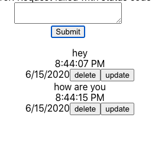

# Message Board
<p align="center">
  
</p>

## User Stories

```
As a User,
So I can make my opinion know,
I would like to Create a message.

As a User,
So I can see my and others opinions,
I would like to be able to Read a messages.

As a User,
So I can retroactively change my opinions,
I would like the option to Update a messages.

As a User,
So I can take back something I regret saying,
I would like the option to DESTROY a messages.
```

## Tech Used

- JavaScript 
- MongoDB
- Express
- React
- Node.js
- Mocha
- Chai

## Features

You'll be able to:

- Create a message
- Read a message
- Update a message
- DESTROY/Delete a message

## Getting Started

### Local Setup

```sh
$ git clone https://github.com/kealanheena/message_board.git
```

```sh
$ cd messsage_board
```

#### To Start

You'll need to run the backend and front end with

```
npm start
```

You'll also need to run mongo

After that you can create, view, update and delete messages

## Running the tests

to run the backend tests:

```
$ cd backend
$ npm test
```

to run the backend tests:

```
$ cd fontend
$ npm test
```

## Tests 

### Back-End Test

#### App
- MessageApp Tests
  - posts a message
  - gets all messages
  - gets a single message
  - updates a message
  - deletes a message
- message api errors correctly
  - posts a message errors
  - gets all errors when no messages
  - errors if cant find single message
  - errors on bad update
  - errors deleting message that doesn't exist

### Front-End Test
#### App
- MessageApp
  - renders without crashing
  - has textbox
  - has a submit button
  - has message list
  - posts data and clears message box on submit success
  - loads data from API
  - updates message on update
  - removes on delete message
- MessageApp erroring
  - loads err on GET err
  - loads err on Post err
  - loads err on delete err
  - loads err on update err
  
 #### Error Handler
 - Error
  - renders without crashing
  - empty without error
  - displays with error
  
 #### MessageForm
 - Form
  - renders without crashing
  - should update state message when text entered
  - clears messagebox on submit
  
#### MessageList
- List
- takes messages as props and displays them
- each message has update button
- update click toggles edit mode
- each message in list has a delete button
